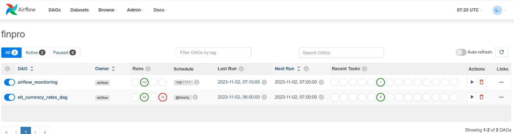

# ETL Currency Rates DAG

## Overview

This Airflow DAG (Directed Acyclic Graph) is designed to perform an ETL (Extract, Transform, Load) process for retrieving and handling currency rate data. It extracts data from an external API, transforms it, and then loads it into a destination, which can include both a CSV file and a PostgreSQL database.

## Prerequisites

- Python 3.x
- Apache Airflow
- Dependencies defined in your Airflow environment

## Project Structure

The project is structured as follows:

- `dags/finpro.py`: The Airflow DAG file that orchestrates the ETL process.
  - `extract/extract.py`: Contains the logic for data extraction.
  - `transform/transform.py`: Contains the logic for data transformation.
  - `load/load.py`: Contains the logic for data loading.
- `sql/data_viz_query.sql`: This file contains SQL queries used to retrieve and structure data for creating visualizations, like charts and graphs.
- `data/table/exchange_rates.sql`: Base Export exchange rates table.
- `data/currency_rates/{%Y-%m-%d %H}.csv` is a file that contains currency exchange rates data.

## DAG Configuration

The Airflow DAG is configured with the following parameters:

- **DAG ID**: etl_currency_rates_dag
- **Start Date**: 2023-10-18
- **Schedule Interval**: Hourly (schedule_interval='@hourly')
- **Catchup**: Disabled (catchup=False)

## Dashboard
- https://lookerstudio.google.com/u/0/reporting/2ae9e0c9-6a27-49a8-b757-0d803c80937a/page/8lwgD

## Installation

1. Install Python 3.x if not already installed.
2. Install Apache Airflow. You can use pip to install Airflow:

```bash
pip install apache-airflow
```

## Usage
Place the DAG file (finpro.py) in your Airflow DAGs directory.
Ensure that the required dependencies are installed and configured.
Start your Airflow scheduler and worker.
The DAG should run on the specified schedule interval.

## Customization
You may need to customize the following aspects of the project:

Configuration variables in your DAG file (e.g., API endpoints, database connection details).
The data extraction logic in extract.py.
The data transformation logic in transform.py.
The data loading logic in load.py.

## Screenshot


## License
This project is licensed under the MIT License. See the LICENSE file for details.

## Author
Lukman

## Acknowledgments
Apache Airflow: Open-source platform for orchestrating complex workflows.
